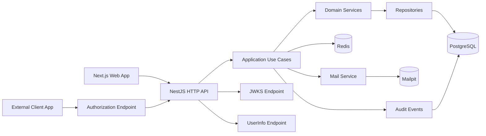

# Documento Tecnico - AuthForge

## 1. Visao Geral

**AuthForge** e uma plataforma educacional de autenticacao, autorizacao e identidade para aplicacoes SaaS.

O projeto combina tres frentes principais:

- SaaS multi-tenant;
- seguranca de conta;
- identity provider OAuth/OIDC-inspired.

O objetivo principal nao e criar um provedor de identidade comercial real ou certificado, mas demonstrar minhas competencias de backend em um dominio critico para empresas: identidade, sessoes, permissoes, organizacoes, tokens, auditoria e seguranca.

## 2. Objetivo de Portfolio

O AuthForge deve demonstrar dominio sobre:

- autenticacao segura;
- autorizacao baseada em roles e permissoes;
- multi-tenancy;
- sessoes por dispositivo;
- refresh token rotation;
- revogacao de sessoes;
- verificacao de email;
- recuperacao de senha;
- convites para organizacoes;
- auditoria de seguranca;
- rate limit em rotas sensiveis;
- gerenciamento de client apps;
- fluxo OAuth2/OIDC-inspired;
- validacao de entradas;
- validacao de variaveis de ambiente;
- logs estruturados;
- testes automatizados;
- documentacao clara para GitHub publico.

Frase de apresentacao:

> AuthForge e uma plataforma educacional de identidade para aplicacoes SaaS, com organizacoes, RBAC, sessoes seguras, refresh token rotation, client apps e fluxo OAuth/OIDC-inspired.

## 3. Problema que o Projeto Resolve

Autenticacao parece simples quando vista apenas como login e senha. Em sistemas reais, porem, identidade envolve muitas preocupacoes:

- proteger contas de usuarios;
- controlar sessoes ativas;
- revogar acessos comprometidos;
- separar dados por organizacao;
- permitir usuarios em multiplas organizacoes;
- aplicar roles e permissoes;
- enviar convites seguros;
- auditar eventos sensiveis;
- permitir que outras aplicacoes usem o sistema como provedor de identidade.

O AuthForge simula esse tipo de problema em um ambiente educacional e demonstravel.

## 4. Escopo do Projeto

### 4.1 Entra no MVP

- aplicacao web responsiva;
- autenticacao com email e senha;
- verificacao de email;
- recuperacao de senha;
- troca de senha;
- access token curto;
- refresh token rotation;
- sessoes por dispositivo;
- logout da sessao atual;
- logout de todos os dispositivos;
- revogacao de sessao;
- bloqueio temporario apos muitas tentativas de login;
- rate limit em rotas sensiveis;
- criacao de organizacoes;
- usuario em multiplas organizacoes;
- troca de organizacao ativa;
- membros por organizacao;
- convites por email;
- aceite de convite;
- roles iniciais;
- permissoes granulares;
- guards de autorizacao;
- auditoria de eventos de seguranca;
- cadastro de client apps;
- `clientId`;
- `clientSecret` para apps confidenciais;
- redirect URIs permitidas;
- authorization code flow com PKCE;
- emissao de access token para client app;
- emissao de ID token inspirado em OIDC;
- endpoint user info;
- endpoint JWKS;
- painel web simples;
- Mailpit para emails locais;
- Docker Compose apenas para PostgreSQL, Redis e Mailpit;
- testes automatizados para regras criticas;
- README completo para GitHub publico.

### 4.2 Fora do MVP

- certificacao oficial OAuth2/OIDC;
- conformidade completa com OIDC;
- SAML;
- SCIM;
- passkeys;
- login social;
- MFA obrigatorio;
- biometria;
- gestao enterprise avancada;
- politicas complexas de senha por organizacao;
- billing real;
- integracao com provedores de email reais;
- painel administrativo altamente refinado;
- suporte multi-idioma.

## 5. Decisoes Ja Tomadas

| Area                   | Decisao                                  |
| ---------------------- | ---------------------------------------- |
| Nome                   | AuthForge                                |
| Tipo                   | Plataforma web responsiva                |
| Backend                | NestJS                                   |
| Frontend               | Next.js                                  |
| Gerenciador de pacotes | npm                                      |
| Banco principal        | PostgreSQL                               |
| ORM                    | Prisma                                   |
| Cache/rate limit/apoio | Redis                                    |
| Email local            | Mailpit                                  |
| Docker local           | Apenas PostgreSQL, Redis e Mailpit       |
| Validacao              | Zod                                      |
| Logger                 | Pino ou Winston                          |
| Repositorio            | Local primeiro, depois publico no GitHub |
| Padrao de commits      | Conventional Commits                     |
| Versionamento          | Semantic Versioning                      |
| Git hooks              | Husky, commitlint e lint-staged          |
| OAuth/OIDC             | Inspired, sem promessa de certificacao   |

### 5.1 Ambiente Local

O Docker Compose deve ser usado apenas para dependencias de infraestrutura:

- PostgreSQL;
- Redis;
- Mailpit.

A API NestJS e o frontend Next.js devem rodar diretamente na maquina local usando npm.

Motivos:

- manter o ciclo de desenvolvimento mais simples;
- facilitar debug local;
- evitar rebuild de containers para alteracoes comuns de codigo;
- deixar o Docker focado apenas nos servicos de apoio.

### 5.2 Padroes Obrigatorios de Engenharia

O projeto deve ser configurado desde o inicio com padroes de qualidade, seguranca e consistencia.

#### Repositorio e fluxo de commits

- criar um repositorio local para desenvolvimento;
- publicar o repositorio no GitHub quando a base inicial estiver organizada;
- usar Conventional Commits;
- usar Semantic Versioning;
- configurar Git hooks locais com Husky;
- validar mensagens de commit com commitlint;
- executar lint/format em arquivos alterados com lint-staged;
- manter `.gitignore` bem configurado;
- nunca versionar secrets, tokens ou arquivos `.env` reais.

#### Qualidade de codigo

- ESLint rigoroso;
- evitar uso de `any`;
- proibir `console.log`;
- padronizar imports;
- remover imports, variaveis, funcoes e classes nao utilizadas;
- evitar codigo morto;
- nomear funcoes, classes, variaveis, arquivos e modulos com nomes claros;
- alinhar regras do lint ao contexto real do projeto.

#### Formatacao

- usar Prettier;
- manter `.prettierrc` versionado;
- padronizar formatacao entre backend, frontend e pacotes compartilhados.

#### Validacao e tipagem

- usar Zod para validacao de dados de entrada;
- validar `body`, `params` e `query`;
- validar variaveis de ambiente em runtime;
- criar arquivo `env.ts` para centralizar leitura e validacao de envs;
- impedir a aplicacao de iniciar se uma variavel obrigatoria estiver ausente;
- manter `.env.example` com todas as variaveis necessarias;
- nao usar fallback silencioso para variaveis obrigatorias.

Exemplo proibido:

```ts
process.env.PORT || 3000;
```

A porta, assim como as outras configuracoes obrigatorias, deve vir de env validada.

#### Logs

- substituir completamente `console.log`;
- usar logger estruturado com Pino ou Winston;
- niveis minimos: `info`, `warn`, `error`;
- incluir contexto relevante nos logs;
- incluir `requestId` quando existir requisicao HTTP;
- incluir servico ou modulo responsavel pelo log;
- incluir stack trace em erros quando aplicavel;
- nunca expor dados sensiveis em logs.

#### Seguranca

- validar todos os inputs;
- aplicar rate limit em endpoints sensiveis;
- usar headers de seguranca com Helmet quando aplicavel;
- nunca expor secrets, tokens ou variaveis sensiveis;
- revisar logs para evitar vazamento de dados.

#### Tratamento de erros

- criar error handler global;
- padronizar erros com uma estrutura como `AppError`;
- retornar codigo HTTP adequado;
- retornar mensagem clara;
- controlar detalhes expostos ao cliente;
- esconder detalhes internos em ambiente de producao.

## 6. Aviso Sobre OAuth/OIDC

O AuthForge tera um fluxo **OAuth/OIDC-inspired** para fins educacionais.

Isso significa que o projeto deve se inspirar em conceitos de OAuth2, OpenID Connect e JWT, mas nao deve se apresentar como uma implementacao certificada ou completamente compativel com OIDC.

Referencias conceituais:

- OAuth2 Authorization Framework: RFC 6749;
- JSON Web Token: RFC 7519;
- OpenID Connect Core 1.0;
- OAuth 2.0 Security Best Current Practice: RFC 9700.

Mensagem para README:

> Este projeto e educacional e implementa um fluxo OAuth/OIDC-inspired para demonstrar conceitos de identidade, autorizacao, tokens e client apps. Ele nao e um provedor de identidade certificado e nao deve ser usado em producao como substituto de solucoes especializadas.

## 7. Usuarios e Atores do Sistema

### 7.1 Usuario

Pode:

- criar conta;
- verificar email;
- fazer login;
- gerenciar sessoes;
- trocar senha;
- recuperar senha;
- criar organizacao;
- participar de multiplas organizacoes;
- aceitar convite;
- alternar organizacao ativa;
- acessar recursos conforme permissoes.

### 7.2 Owner da Organizacao

Pode:

- gerenciar membros;
- convidar usuarios;
- remover membros;
- alterar roles;
- gerenciar client apps da organizacao;
- visualizar auditoria da organizacao.

### 7.3 Admin da Organizacao

Pode:

- convidar membros;
- gerenciar membros com permissoes limitadas;
- visualizar parte da auditoria;
- gerenciar configuracoes permitidas.

### 7.4 Client App

Representa uma aplicacao externa que usa o AuthForge para autenticar usuarios.

Pode:

- iniciar fluxo de autorizacao;
- receber authorization code;
- trocar code por tokens;
- chamar endpoint user info.

## 8. Principais Regras de Negocio

### 8.1 Conta de Usuario

- Email deve ser unico.
- Senha deve ser armazenada apenas como hash.
- Usuario precisa verificar email para acessar recursos sensiveis.
- Muitas tentativas de login falhas devem causar bloqueio temporario.
- Eventos sensiveis devem ser auditados.

### 8.2 Sessao

- Cada login cria uma sessao.
- Sessao deve guardar informacoes de dispositivo quando disponiveis.
- Usuario pode revogar uma sessao especifica.
- Usuario pode fazer logout de todos os dispositivos.
- Refresh tokens devem ser rotacionados.
- Refresh token antigo nao deve continuar valido apos rotacao.

### 8.3 Organizacao

- Uma organizacao possui membros.
- Um usuario pode participar de varias organizacoes.
- Cada membro possui role dentro da organizacao.
- Toda acao em contexto organizacional deve validar membership.
- A organizacao ativa deve ser explicita no request.

### 8.4 Roles e Permissoes

Roles iniciais:

- `owner`;
- `admin`;
- `member`;
- `viewer`.

Permissoes iniciais sugeridas:

- `organization:read`;
- `organization:update`;
- `members:read`;
- `members:invite`;
- `members:update`;
- `members:remove`;
- `client_apps:read`;
- `client_apps:create`;
- `client_apps:update`;
- `client_apps:delete`;
- `audit_logs:read`.

### 8.5 Convites

- Convite pertence a uma organizacao.
- Convite deve ter email de destino.
- Convite deve expirar.
- Convite aceito nao pode ser reutilizado.
- Convite cancelado nao pode ser aceito.
- Aceitar convite cria membership.

### 8.6 Client Apps

- Client app pertence a uma organizacao.
- Client app possui `clientId`.
- Client app confidencial possui `clientSecret` armazenado com hash.
- Redirect URIs devem ser previamente cadastradas.
- Authorization code deve ter expiracao curta.
- Authorization code deve ser de uso unico.
- PKCE deve ser obrigatorio para apps publicos.

## 9. Arquitetura Geral

Fluxo de alto nivel:



### 9.1 Camadas

#### Controllers HTTP

Responsaveis por:

- receber requisicoes REST;
- validar entradas;
- chamar casos de uso;
- retornar respostas padronizadas.

#### Use Cases

Responsaveis por orquestrar operacoes como:

- registrar usuario;
- verificar email;
- autenticar usuario;
- rotacionar refresh token;
- criar organizacao;
- convidar membro;
- aceitar convite;
- autorizar client app;
- emitir tokens;
- revogar sessao.

#### Domain Services

Responsaveis por regras de negocio:

- politica de senha;
- validacao de transicao de sessao;
- validacao de permissao;
- emissao e validacao de authorization code;
- validacao de redirect URI;
- validacao de PKCE;
- geracao de tokens.

#### Repositories

Responsaveis por acesso ao PostgreSQL via Prisma.

#### Redis

Responsavel por:

- rate limit;
- bloqueio temporario de login;
- cache auxiliar de JWKS se necessario;
- blacklist ou marcadores temporarios quando fizer sentido.

#### Mail Service

Responsavel por:

- email de verificacao;
- email de recuperacao de senha;
- email de convite.

No ambiente local, os emails devem ser enviados para Mailpit.

## 10. Modulos do Backend

### 10.1 Auth Module

Responsavel por:

- registro;
- login;
- refresh token rotation;
- logout;
- logout de todos os dispositivos;
- verificacao de email;
- recuperacao de senha;
- troca de senha.

### 10.2 Users Module

Responsavel por:

- perfil do usuario;
- dados basicos;
- atualizacao de dados;
- consulta do usuario autenticado.

### 10.3 Sessions Module

Responsavel por:

- sessoes por dispositivo;
- revogacao de sessao;
- listagem de sessoes;
- armazenamento de hash de refresh token;
- controle de expiracao.

### 10.4 Organizations Module

Responsavel por:

- criacao de organizacao;
- dados da organizacao;
- membership;
- organizacao ativa;
- regras multi-tenant.

### 10.5 RBAC Module

Responsavel por:

- roles;
- permissoes;
- verificacao de permissao;
- guards;
- decorators.

### 10.6 Invitations Module

Responsavel por:

- criar convite;
- enviar email de convite;
- aceitar convite;
- cancelar convite;
- expirar convite.

### 10.7 Client Apps Module

Responsavel por:

- cadastrar client apps;
- gerar `clientId`;
- gerar e armazenar hash de `clientSecret`;
- cadastrar redirect URIs;
- ativar/desativar apps.

### 10.8 OAuth Inspired Module

Responsavel por:

- authorization endpoint;
- consentimento simplificado;
- authorization code;
- PKCE;
- token endpoint;
- ID token;
- access token para client apps;
- user info endpoint;
- JWKS endpoint.

### 10.9 Mail Module

Responsavel por:

- templates de email;
- envio via Mailpit no ambiente local;
- registro de falhas de envio quando fizer sentido.

### 10.10 Audit Module

Responsavel por:

- registrar eventos de seguranca;
- registrar eventos administrativos;
- permitir consulta por organizacao;
- permitir consulta por usuario.

### 10.11 Security Module

Responsavel por:

- rate limit;
- bloqueio por tentativas de login;
- headers de seguranca;
- utilitarios criptograficos.

## 11. Modelagem Inicial de Dados

### 11.1 User

Campos principais:

- `id`;
- `name`;
- `email`;
- `emailVerifiedAt`;
- `passwordHash`;
- `status`;
- `createdAt`;
- `updatedAt`.

Status possiveis:

- `active`;
- `pending_email_verification`;
- `blocked`;
- `disabled`.

### 11.2 EmailVerificationToken

Campos principais:

- `id`;
- `userId`;
- `tokenHash`;
- `expiresAt`;
- `usedAt`;
- `createdAt`.

### 11.3 PasswordResetToken

Campos principais:

- `id`;
- `userId`;
- `tokenHash`;
- `expiresAt`;
- `usedAt`;
- `createdAt`.

### 11.4 Session

Campos principais:

- `id`;
- `userId`;
- `refreshTokenHash`;
- `userAgent`;
- `ipAddress`;
- `deviceName`;
- `expiresAt`;
- `revokedAt`;
- `lastUsedAt`;
- `createdAt`.

### 11.5 Organization

Campos principais:

- `id`;
- `name`;
- `slug`;
- `status`;
- `createdAt`;
- `updatedAt`.

### 11.6 OrganizationMember

Campos principais:

- `id`;
- `organizationId`;
- `userId`;
- `role`;
- `createdAt`;
- `updatedAt`.

Restricao sugerida:

- `organizationId + userId` deve ser unico.

### 11.7 Invitation

Campos principais:

- `id`;
- `organizationId`;
- `email`;
- `role`;
- `tokenHash`;
- `status`;
- `expiresAt`;
- `acceptedAt`;
- `createdByUserId`;
- `createdAt`.

Status possiveis:

- `pending`;
- `accepted`;
- `expired`;
- `cancelled`.

### 11.8 Permission

Campos principais:

- `id`;
- `key`;
- `description`;
- `createdAt`.

### 11.9 RolePermission

Campos principais:

- `id`;
- `role`;
- `permissionId`;
- `createdAt`.

### 11.10 ClientApp

Campos principais:

- `id`;
- `organizationId`;
- `name`;
- `clientId`;
- `clientSecretHash`;
- `type`;
- `status`;
- `createdAt`;
- `updatedAt`.

Tipos possiveis:

- `public`;
- `confidential`.

Status possiveis:

- `active`;
- `disabled`.

### 11.11 ClientRedirectUri

Campos principais:

- `id`;
- `clientAppId`;
- `uri`;
- `createdAt`.

Restricao sugerida:

- `clientAppId + uri` deve ser unico.

### 11.12 AuthorizationCode

Campos principais:

- `id`;
- `clientAppId`;
- `userId`;
- `organizationId`;
- `codeHash`;
- `redirectUri`;
- `codeChallenge`;
- `codeChallengeMethod`;
- `expiresAt`;
- `usedAt`;
- `createdAt`.

### 11.13 SigningKey

Campos principais:

- `id`;
- `kid`;
- `publicKey`;
- `privateKeyEncrypted`;
- `algorithm`;
- `status`;
- `createdAt`;
- `rotatedAt`.

Status possiveis:

- `active`;
- `retired`.

### 11.14 AuditLog

Campos principais:

- `id`;
- `actorUserId`;
- `organizationId`;
- `action`;
- `entityType`;
- `entityId`;
- `ipAddress`;
- `userAgent`;
- `metadata`;
- `createdAt`.

## 12. Fluxos Principais

### 12.1 Cadastro e Verificacao de Email

1. Usuario cria conta.
2. Backend valida entrada.
3. Backend cria usuario com senha hasheada.
4. Backend gera token de verificacao.
5. Backend envia email via Mailpit.
6. Usuario acessa link.
7. Backend valida token.
8. Backend marca email como verificado.
9. Backend registra auditoria.

### 12.2 Login com Sessao

1. Usuario envia email e senha.
2. Backend aplica rate limit.
3. Backend verifica bloqueio temporario.
4. Backend valida credenciais.
5. Backend cria sessao.
6. Backend emite access token curto.
7. Backend emite refresh token.
8. Backend armazena hash do refresh token.
9. Backend registra auditoria.

### 12.3 Refresh Token Rotation

1. Cliente envia refresh token.
2. Backend localiza sessao.
3. Backend compara hash do refresh token.
4. Backend revoga token anterior.
5. Backend gera novo refresh token.
6. Backend atualiza hash na sessao.
7. Backend emite novo access token.
8. Backend registra `lastUsedAt`.

Se um refresh token antigo for reutilizado, o sistema deve tratar como tentativa suspeita e revogar a sessao.

### 12.4 Logout de Sessao

1. Usuario solicita logout.
2. Backend identifica sessao atual.
3. Backend marca sessao como revogada.
4. Backend registra auditoria.

### 12.5 Criacao de Organizacao

1. Usuario autenticado cria organizacao.
2. Backend valida nome e slug.
3. Backend cria organizacao.
4. Backend cria membership com role `owner`.
5. Backend registra auditoria.

### 12.6 Convite para Organizacao

1. Owner/admin informa email e role.
2. Backend valida permissao.
3. Backend cria convite com expiracao.
4. Backend envia email via Mailpit.
5. Convidado acessa link.
6. Backend valida token.
7. Backend cria membership.
8. Convite vira `accepted`.
9. Backend registra auditoria.

### 12.7 Authorization Code Flow com PKCE

1. Client app redireciona usuario para endpoint de autorizacao.
2. AuthForge valida `clientId`.
3. AuthForge valida `redirectUri`.
4. AuthForge valida parametros de PKCE.
5. Usuario autentica, se ainda nao estiver logado.
6. Usuario confirma autorizacao em tela simplificada.
7. AuthForge gera authorization code.
8. AuthForge redireciona para `redirectUri` com `code`.
9. Client app troca `code` por tokens no token endpoint.
10. AuthForge valida code, client app e PKCE.
11. AuthForge marca code como usado.
12. AuthForge emite access token e ID token.

### 12.8 User Info

1. Client app envia access token.
2. Backend valida assinatura e claims.
3. Backend retorna dados basicos do usuario.

## 13. Endpoints HTTP Iniciais

### 13.1 Auth

- `POST /auth/register`;
- `POST /auth/login`;
- `POST /auth/refresh`;
- `POST /auth/logout`;
- `POST /auth/logout-all`;
- `POST /auth/verify-email`;
- `POST /auth/resend-verification`;
- `POST /auth/forgot-password`;
- `POST /auth/reset-password`;
- `POST /auth/change-password`.

### 13.2 Users

- `GET /users/me`;
- `PATCH /users/me`;

### 13.3 Sessions

- `GET /sessions`;
- `DELETE /sessions/:id`;

### 13.4 Organizations

- `POST /organizations`;
- `GET /organizations`;
- `GET /organizations/:id`;
- `PATCH /organizations/:id`;

### 13.5 Members

- `GET /organizations/:id/members`;
- `PATCH /organizations/:id/members/:memberId`;
- `DELETE /organizations/:id/members/:memberId`;

### 13.6 Invitations

- `POST /organizations/:id/invitations`;
- `GET /organizations/:id/invitations`;
- `POST /invitations/accept`;
- `POST /organizations/:id/invitations/:invitationId/cancel`;

### 13.7 Client Apps

- `POST /organizations/:id/client-apps`;
- `GET /organizations/:id/client-apps`;
- `GET /organizations/:id/client-apps/:clientAppId`;
- `PATCH /organizations/:id/client-apps/:clientAppId`;
- `DELETE /organizations/:id/client-apps/:clientAppId`;
- `POST /organizations/:id/client-apps/:clientAppId/redirect-uris`;
- `DELETE /organizations/:id/client-apps/:clientAppId/redirect-uris/:uriId`.

### 13.8 OAuth/OIDC-Inspired

- `GET /oauth/authorize`;
- `POST /oauth/token`;
- `GET /oauth/userinfo`;
- `GET /.well-known/jwks.json`;

### 13.9 Audit

- `GET /organizations/:id/audit-logs`;

## 14. Estrategia de Tokens e Sessao

### 14.1 Access Token

- Deve ter curta duracao.
- Deve conter claims minimas.
- Deve conter `sub`.
- Pode conter organizacao ativa quando aplicavel.
- Nao deve carregar dados sensiveis.

### 14.2 Refresh Token

- Deve ter duracao maior que o access token.
- Deve ser armazenado no servidor apenas como hash.
- Deve ser rotacionado a cada uso.
- Reuso de refresh token antigo deve ser tratado como suspeito.

### 14.3 ID Token

- Deve ser emitido no fluxo OAuth/OIDC-inspired.
- Deve representar autenticacao do usuario.
- Deve conter claims basicas como `sub`, `email`, `name`, `iat`, `exp`, `aud`, `iss`.
- Nao deve conter permissoes detalhadas ou dados sensiveis.

### 14.4 JWKS

- O projeto deve expor uma chave publica para validacao dos tokens assinados.
- Deve haver modelagem para rotacao futura de chaves.
- Rotacao completa pode ficar como evolucao futura.

## 15. Estrategia de Autorizacao

Autorizacao deve acontecer em camadas:

1. usuario autenticado;
2. email verificado quando necessario;
3. membership na organizacao;
4. role do membro;
5. permissao especifica.

Exemplo:

```txt
Para convidar membro:
usuario autenticado
+ pertence a organizacao
+ possui permissao members:invite
```

O backend deve ser a autoridade sobre permissoes. O frontend apenas adapta a interface.

## 16. Estrategia de Email

No ambiente local, os emails devem ser enviados para Mailpit.

Emails do MVP:

- verificacao de email;
- recuperacao de senha;
- convite para organizacao.

O projeto nao deve depender de provedor de email real no MVP.

## 17. Estrategia de Rate Limit e Protecao

Redis sera usado para:

- limitar tentativas de login;
- limitar pedido de recuperacao de senha;
- limitar reenvio de verificacao de email;
- limitar troca de tokens;
- bloquear temporariamente email/IP apos abuso.

Endpoints sensiveis devem ter rate limit mais restrito:

- `/auth/login`;
- `/auth/forgot-password`;
- `/auth/reset-password`;
- `/auth/resend-verification`;
- `/oauth/token`.

## 18. Estrategia de Auditoria

Eventos que devem ser auditados:

- usuario registrado;
- email verificado;
- login bem-sucedido;
- login falho;
- bloqueio temporario;
- refresh token rotacionado;
- reuso suspeito de refresh token;
- logout;
- logout de todos os dispositivos;
- senha alterada;
- recuperacao de senha solicitada;
- organizacao criada;
- membro convidado;
- convite aceito;
- role alterada;
- membro removido;
- client app criado;
- client app desativado;
- authorization code emitido;
- token emitido para client app.

## 19. Seguranca

Medidas previstas:

- hash forte de senhas;
- hash de tokens sensiveis;
- refresh token rotation;
- revogacao de sessoes;
- rate limit;
- Helmet quando aplicavel;
- CORS configurado;
- validacao obrigatoria de inputs;
- validacao de envs;
- logs sem dados sensiveis;
- secrets fora do repositorio;
- `.env.example` sem credenciais reais;
- mensagens de erro controladas;
- auditoria de eventos sensiveis.

## 20. Observabilidade

O projeto deve registrar:

- logs estruturados;
- correlation ID por requisicao;
- eventos de auditoria;
- falhas de login;
- bloqueios temporarios;
- falhas de envio de email;
- falhas no fluxo OAuth-inspired;
- reuso suspeito de refresh token;
- erros de validacao.

Metricas interessantes para demonstracao:

- tentativas de login por minuto;
- logins falhos por usuario/IP;
- sessoes ativas;
- refresh tokens rotacionados;
- convites pendentes;
- authorization codes emitidos;
- tokens emitidos por client app.

## 21. Testes

### 21.1 Testes Unitarios

Devem cobrir:

- politica de senha;
- criacao de tokens;
- validacao de permissoes;
- validacao de roles;
- validacao de redirect URI;
- validacao de PKCE;
- transicoes de convite;
- regras de sessao.

### 21.2 Testes de Integracao

Devem cobrir:

- registro;
- verificacao de email;
- login;
- refresh token rotation;
- reuso de refresh token antigo;
- logout;
- criacao de organizacao;
- convite e aceite;
- alteracao de role;
- authorization code flow;
- token endpoint;
- user info.

### 21.3 Testes E2E

Devem cobrir:

- cadastro completo com email;
- login e listagem de sessoes;
- criacao de organizacao;
- convite de membro;
- criacao de client app;
- fluxo OAuth/OIDC-inspired basico.

## 22. Frontend

O frontend sera uma aplicacao Next.js responsiva.

Telas principais:

- login;
- cadastro;
- verificacao de email;
- recuperacao de senha;
- reset de senha;
- dashboard;
- minhas sessoes;
- organizacoes;
- membros;
- convites;
- client apps;
- redirect URIs;
- auditoria;
- tela de autorizacao de client app.

O frontend deve demonstrar os fluxos principais, mas o foco do projeto e backend.

## 23. Estrutura Sugerida de Repositorio

Opcao recomendada: monorepo.

Gerenciador de pacotes recomendado: npm com npm workspaces.

O Docker Compose deve existir no repositorio, mas deve subir apenas PostgreSQL, Redis e Mailpit. A API NestJS e o frontend Next.js devem ser executados com scripts npm.

```txt
authforge/
  apps/
    api/
    web/
  packages/
    shared/
  docker/
  docs/
  scripts/
  docker-compose.yml
  README.md
  .env.example
```

### 23.1 Apps

- `apps/api`: backend NestJS.
- `apps/web`: frontend Next.js.

### 23.2 Packages

- `packages/shared`: tipos compartilhados, constantes e contratos se fizer sentido.

### 23.3 Docs

- documentacao tecnica;
- diagramas;
- decisoes arquiteturais;
- exemplos de fluxos.

## 24. README Esperado para GitHub

O README deve conter:

- apresentacao clara do projeto;
- aviso educacional;
- aviso sobre OAuth/OIDC-inspired;
- principais features;
- arquitetura;
- stack;
- padroes de qualidade do projeto;
- convencao de commits;
- estrategia de versionamento;
- como rodar localmente;
- variaveis de ambiente;
- como usar Mailpit;
- como testar verificacao de email;
- como testar recuperacao de senha;
- como testar fluxo OAuth-inspired;
- exemplos de fluxo;
- prints ou GIFs;
- testes;
- roadmap;
- limitacoes conhecidas.

Aviso sugerido:

> AuthForge e um projeto educacional de portfolio. Ele simula uma plataforma de identidade para SaaS com autenticacao, autorizacao, organizacoes, sessoes e fluxo OAuth/OIDC-inspired. O projeto nao e certificado como provedor OAuth2/OIDC e nao deve ser usado em producao como substituto de solucoes especializadas.

### 24.1 Estrategia de Evolucao Publica no LinkedIn

Como o AuthForge sera desenvolvido com calma e com decisoes tecnicas bem pensadas, a evolucao do projeto tambem deve ser documentada publicamente no LinkedIn.

Objetivos:

- mostrar a trajetoria real de construcao do projeto;
- explicar decisoes tecnicas de forma acessivel;
- gerar visibilidade profissional;
- demonstrar consistencia, clareza e evolucao;
- transformar desafios tecnicos em conteudo de aprendizado.

Tipos de publicacao:

- apresentacao da ideia do AuthForge;
- por que autenticacao vai alem de login;
- modelagem de usuarios, sessoes e refresh tokens;
- refresh token rotation;
- multi-tenancy com organizacoes;
- RBAC e permissoes;
- convites para organizacoes;
- auditoria de eventos de seguranca;
- fluxo OAuth/OIDC-inspired;
- aprendizados e dificuldades durante o desenvolvimento.

## 25. Riscos Tecnicos

### 25.1 Escopo Grande Demais

Risco:

- tentar construir uma alternativa completa a Auth0, Clerk ou Keycloak.

Mitigacao:

- deixar claro que e educacional;
- limitar o MVP;
- implementar OAuth/OIDC-inspired sem promessa de certificacao;
- priorizar fluxos demonstraveis.

### 25.2 Falhas de Seguranca

Risco:

- guardar tokens ou senhas de forma insegura.

Mitigacao:

- hash forte;
- token sensivel armazenado apenas como hash;
- logs sem secrets;
- testes de regras criticas;
- revisao de endpoints sensiveis.

### 25.3 Refresh Token Rotation Mal Implementado

Risco:

- refresh token antigo continuar valido.

Mitigacao:

- armazenar hash por sessao;
- rotacionar a cada uso;
- invalidar sessao ao detectar reuso suspeito;
- testar esse fluxo explicitamente.

### 25.4 Multi-Tenant Mal Isolado

Risco:

- usuario acessar dados de organizacao onde nao e membro.

Mitigacao:

- membership obrigatoria em todos os endpoints organizacionais;
- guards de organizacao;
- testes de isolamento.

### 25.5 OAuth/OIDC-Inspired Confundido com Certificacao

Risco:

- parecer que o projeto promete compatibilidade completa.

Mitigacao:

- documentar claramente o carater educacional;
- usar o termo OAuth/OIDC-inspired;
- listar limitacoes conhecidas.

## 26. Decisoes Pendentes

As seguintes decisoes ainda precisam ser fechadas:

- tempo padrao do access token;
- tempo padrao do refresh token;
- refresh token em cookie httpOnly ou retorno no body;
- MFA entra no MVP ou fica como futuro;
- quais claims entram no access token;
- quais claims entram no ID token;
- quais permissoes iniciais entram no seed;
- se o painel admin sera simples ou mais completo;
- estrategia de deploy demonstravel.

## 27. Criterios de Sucesso do MVP

O MVP sera considerado pronto quando:

- usuario conseguir registrar conta;
- usuario conseguir verificar email via Mailpit;
- usuario conseguir fazer login;
- login criar sessao por dispositivo;
- refresh token rotation funcionar;
- refresh token antigo reutilizado revogar sessao;
- usuario conseguir listar e revogar sessoes;
- usuario conseguir criar organizacao;
- usuario conseguir convidar membro;
- convite puder ser aceito;
- roles e permissoes forem aplicadas;
- usuario nao conseguir acessar organizacao onde nao e membro;
- client app puder ser criado;
- redirect URI for validada;
- authorization code flow com PKCE funcionar;
- token endpoint emitir tokens;
- user info endpoint retornar dados do usuario;
- JWKS endpoint expor chave publica;
- auditoria registrar eventos sensiveis;
- testes cobrirem auth, sessoes, RBAC e OAuth-inspired;
- PostgreSQL, Redis e Mailpit rodarem com Docker Compose;
- API e frontend rodarem localmente com npm;
- README explicar claramente como testar os fluxos.

## 28. Resumo Executivo

O AuthForge sera um projeto forte de portfolio backend porque demonstra um dominio essencial em sistemas reais: identidade.

Ele combina:

- autenticacao;
- seguranca de conta;
- refresh token rotation;
- sessoes por dispositivo;
- multi-tenancy;
- RBAC;
- convites;
- auditoria;
- client apps;
- fluxo OAuth/OIDC-inspired;
- validacao;
- rate limit;
- testes.

O projeto deve ser desenvolvido com foco em clareza, seguranca, demonstrabilidade e documentacao publica de qualidade, evitando prometer conformidade completa com padroes complexos de identidade.
